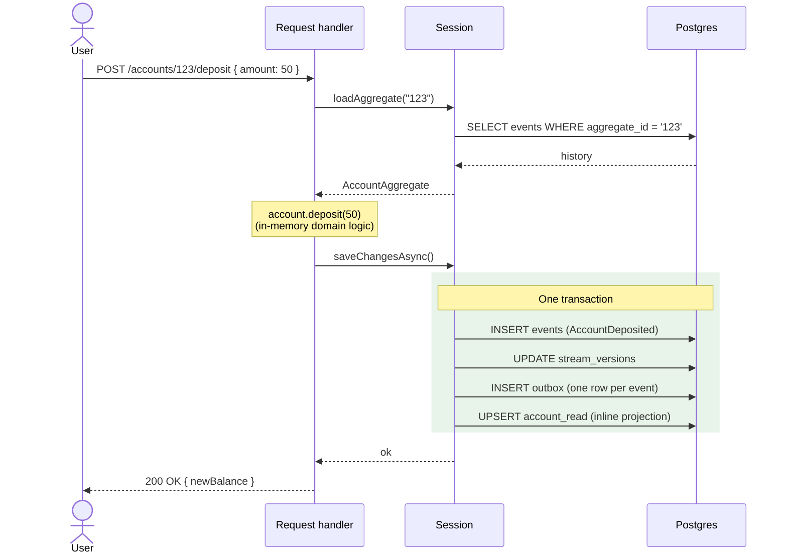
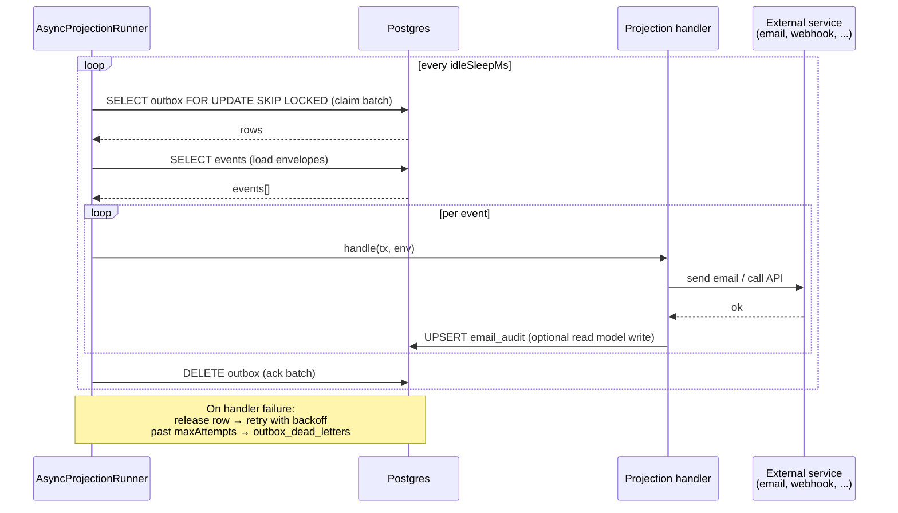
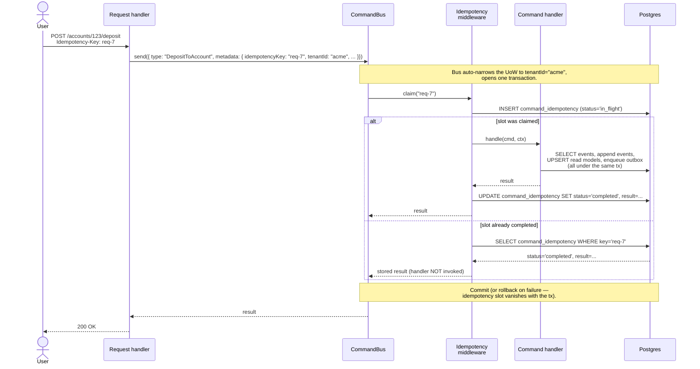
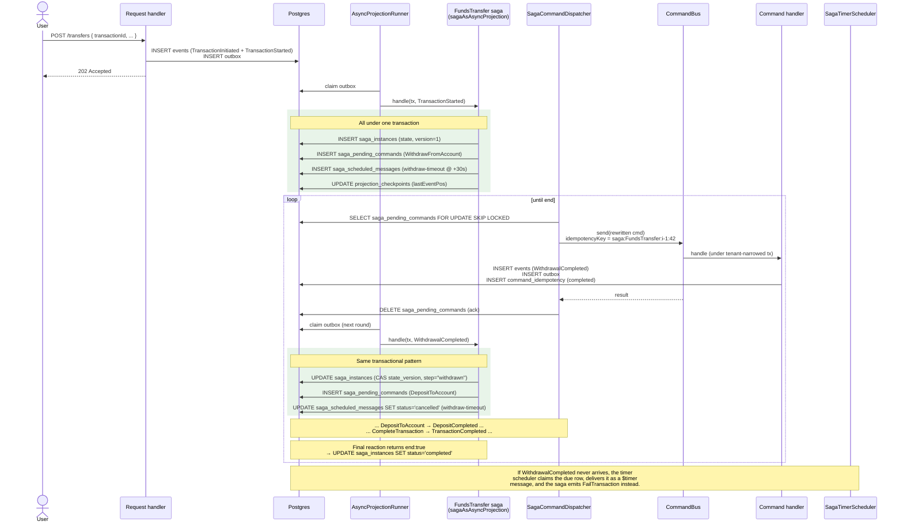

# EventFabric

Type-safe event sourcing framework for TypeScript.

EventFabric provides a database-agnostic core with aggregates, projections (inline, catch-up, async/outbox), snapshots, schema evolution via event upcasters, multi-tenancy, and vendor-neutral observability hooks. A mediator (command bus with idempotency) and a saga (process manager with timers) layer cleanly on top. The `@eventfabric/postgres` family of packages ships a production-ready PostgreSQL adapter out of the box.

## Packages

### Foundation

| Package | Description |
|---|---|
| [`@eventfabric/core`](packages/core/) | Framework-agnostic interfaces, types, and orchestration logic. Zero runtime dependencies. |
| [`@eventfabric/postgres`](packages/postgres/) | PostgreSQL adapter — event store, session, snapshots, outbox, query builder, multi-tenancy. |
| [`@eventfabric/opentelemetry`](packages/opentelemetry/) | OpenTelemetry adapter — spans, metrics, and context propagation for projection runners. |

### Mediator (`0.2.0-beta`)

| Package | Description |
|---|---|
| [`@eventfabric/mediator`](packages/mediator/) | `Command` envelope, `CommandBus`, middleware framework (idempotency + logging), `IdempotencyStore` interface, in-memory store. Backend-agnostic. See the [docs roadmap](docs/mediator.md#roadmap) for planned extensions. |
| [`@eventfabric/mediator-postgres`](packages/mediator-postgres/) | Postgres-backed `PgIdempotencyStore` with claim-recovery + `resetStaleInFlight` watchdog, migration `010`. |
| [`@eventfabric/mediator-opentelemetry`](packages/mediator-opentelemetry/) | `createCommandBusObserver` middleware (tracing + metrics) and `createCommandIdempotencyGauges` (queue health). |

### Sagas (`0.2.0-beta`)

| Package | Description |
|---|---|
| [`@eventfabric/sagas`](packages/sagas/) | `Saga<S, E>` (pure reducer over events + timers), runner, `SagaCommandDispatcher`, `SagaTimerScheduler`, in-memory stores, observer hooks. Sagas emit commands via `@eventfabric/mediator`. |
| [`@eventfabric/sagas-postgres`](packages/sagas-postgres/) | `PgSagaStateStore` (optimistic CAS), `PgSagaCommandQueue` and `PgSagaTimerStore` with FOR UPDATE SKIP LOCKED + watchdogs, migrations `011-013`. |
| [`@eventfabric/sagas-opentelemetry`](packages/sagas-opentelemetry/) | `createSagaObserver` (tracing + counters + duration histograms) and `createSagaQueueGauges` (lag + overdue-timer alert). |

## Quick Start

```bash
pnpm add @eventfabric/core @eventfabric/postgres pg
```

### 1. Define Events

```typescript
type UserEvent =
  | { type: "UserRegistered"; version: 1; userId: string; email: string; displayName: string }
  | { type: "UserEmailChanged"; version: 1; userId: string; email: string };

// Factory functions — type and version baked in, never written manually
const UserRegistered = (data: Omit<UserEvent & { type: "UserRegistered" }, "type" | "version">) =>
  ({ type: "UserRegistered" as const, version: 1 as const, ...data });
```

### 2. Define an Aggregate

```typescript
import { AggregateRoot, type HandlerMap } from "@eventfabric/core";

type UserState = { email?: string; displayName?: string };

class UserAggregate extends AggregateRoot<UserState, UserEvent> {
  static readonly aggregateName = "User" as const;

  protected handlers = {
    UserRegistered: (s, e) => { s.email = e.email; s.displayName = e.displayName; },
    UserEmailChanged: (s, e) => { s.email = e.email; }
  } satisfies HandlerMap<UserEvent, UserState>;

  constructor(id: string, snapshot?: UserState) {
    super(id, snapshot ?? {});
  }

  changeEmail(email: string) {
    this.raise({ type: "UserEmailChanged", version: 1, userId: this.id, email });
  }
}
```

### 3. Wire Up the Store

```typescript
import { Pool } from "pg";
import { PgEventStore, PgSnapshotStore, SessionFactory, migrate } from "@eventfabric/postgres";

const pool = new Pool({ connectionString: process.env.DATABASE_URL });
await migrate(pool); // creates all tables on first run, no-op after

const store = new PgEventStore<UserEvent>();
const factory = new SessionFactory(pool, store);

factory.registerAggregate(UserAggregate, [
  "UserRegistered", "UserEmailChanged"
], "user", {
  snapshotStore: new PgSnapshotStore()
});
```

### 4. Use in Request Handlers

```typescript
// Create a new user
app.post("/users/:id/register", async (req, res) => {
  const session = factory.createSession();
  session.startStream(req.params.id, UserRegistered({
    userId: req.params.id,
    email: req.body.email,
    displayName: req.body.name
  }));
  await session.saveChangesAsync();
  res.json({ ok: true });
});

// Update an existing user
app.post("/users/:id/change-email", async (req, res) => {
  const session = factory.createSession();
  const user = await session.loadAggregateAsync<UserAggregate>(req.params.id);
  user.changeEmail(req.body.email);
  await session.saveChangesAsync();
  res.json({ ok: true });
});
```

### 5. Add an Async Projection

```typescript
import { createAsyncProjectionRunner } from "@eventfabric/postgres";

// Send a welcome email when a user registers
const runner = createAsyncProjectionRunner(pool, store, [{
  name: "welcome-email",
  topicFilter: { mode: "include", topics: ["user"] },
  async handle(_tx, env) {
    if (env.payload.type === "UserRegistered") {
      await sendEmail(env.payload.email, "Welcome!", `Hello ${env.payload.displayName}!`);
    }
  }
}], {
  workerId: "email-worker-1",
  batchSize: 10,
  maxAttempts: 5
});

runner.start(new AbortController().signal);
```

### 6. Multi-Tenancy

```typescript
import { ConjoinedTenantResolver, PerDatabaseTenantResolver } from "@eventfabric/postgres";

// Conjoined: all tenants share one database, isolated by tenant_id column
const resolver = new ConjoinedTenantResolver(pool);
const factory = new SessionFactory(resolver, store);
const session = factory.createSession("tenant-acme"); // scoped to tenant

// Per-database: each tenant gets their own database
const resolver = new PerDatabaseTenantResolver({
  acme:    new Pool({ connectionString: "postgres://localhost/acme_db" }),
  contoso: new Pool({ connectionString: "postgres://localhost/contoso_db" }),
});
const factory = new SessionFactory(resolver, store);
const session = factory.createSession("acme"); // uses acme's pool
```

See [multi-tenancy docs](packages/postgres/docs/multi-tenancy.md) for full details.

## How it works — actor-level data flow

Four diagrams, each independently understandable. Together they trace
how events flow from an HTTP actor down into the database, then back
out through projections, sagas, and the mediator.

### 1. Write path — event + inline projection in one transaction

The simplest case. An HTTP handler loads an aggregate, performs a
domain operation, and saves. **One transaction** writes the event,
bumps the stream version, fires inline projections, and enqueues the
outbox. Nothing is half-committed.



What lands in the DB this turn: `events`, `stream_versions`,
`outbox`, and any inline read-model tables. The user gets a strongly-
consistent response — by the time `200 OK` returns, downstream
queries see the new balance.

### 2. Async delivery — outbox → projection → external side effect

The outbox row from step 1 is picked up later by a background runner.
This is where **external** side effects happen: email, webhooks,
external indexes, brokers. The runner guarantees at-least-once
delivery with per-message retry and DLQ.



This loop runs **independent of the write request**. The user already
got their 200 OK in step 1; downstream delivery catches up
eventually. Failed messages park in `outbox_dead_letters` for ops
triage instead of stalling the queue.

### 3. Mediator (Command Bus) — idempotency + atomic effects

The mediator sits in front of the request handler. It adds two
guarantees: **exactly-once effects** for duplicate requests (same
`idempotencyKey`) and **atomic commit** of the work + the
idempotency record. A retried HTTP request, a duplicated SQS
message, or a double-click all return the original result without
re-executing the handler.



What's new in the DB compared to step 1: a row in
`command_idempotency` keyed by `(tenant_id, idempotency_key)`. The
slot and the work commit together — there is no "events appended
but idempotency not recorded" half-state.

### 4. Saga (process manager) — events drive commands drive events

A saga reacts to events, holds per-instance state, and emits
**commands** (queued for the dispatcher) and **timers** (queued for
the scheduler). The chain unfolds over time: each command's handler
emits a follow-up event; the saga sees it, advances its state, and
emits the next command. If the expected follow-up doesn't arrive in
time, the timer fires and the saga compensates.



What's new in the DB this turn: `saga_instances` (the per-instance
state row, CAS-locked on `state_version`), `saga_pending_commands`
(the outbox for saga-emitted commands), and
`saga_scheduled_messages` (the timer queue). Plus everything from
steps 1, 2, and 3 — events, outbox, inline projections, command
idempotency. The saga is **purely additive**: it doesn't replace the
event store or the outbox runner; it composes with them.

### What sticks across all four

- Every state-changing step is **transactional**. Either the events,
  the read-model writes, the outbox row, the saga state advance,
  and the idempotency slot all commit together — or none of them do.
- The **event log is the source of truth**. Read models, sagas,
  idempotency records: all derived from events. Lose any of them and
  you can rebuild from the log.
- **Tenancy is data, not API.** The command's `metadata.tenantId`
  (set by the request handler or the saga dispatcher) is what
  narrows the UoW. No per-call tenant arguments anywhere.

## Documentation

### Design

- [High-Level Design (HLD)](docs/high-level-design.md) — system overview, data flow diagrams, architecture decisions
- [Low-Level Design (LLD)](docs/low-level-design.md) — class internals, algorithms, sequence diagrams, SQL generation

### Guides

- [Getting Started](docs/getting-started.md) — installation, database setup, first aggregate
- [Core Concepts](docs/core-concepts.md) — event sourcing fundamentals, CQRS, how EventFabric maps to them
- [Multi-Tenancy](packages/postgres/docs/multi-tenancy.md) — conjoined (shared database) or per-database isolation

### Write Side

- [Aggregates](docs/aggregates.md) — `AggregateRoot`, state, handlers, commands
- [Events](docs/events.md) — event types, versioning, `EventEnvelope`
- [Event Store](docs/event-store.md) — `PgEventStore`, append, load, concurrency
- [Sessions](docs/sessions.md) — `SessionFactory`, `Session`, identity map, unit of work
- [Snapshots](docs/snapshots.md) — `PgSnapshotStore`, policies, snapshot upcasters
- [Schema Evolution](docs/schema-evolution.md) — event upcasters, migrating event versions
- [Concurrency](docs/concurrency.md) — optimistic concurrency, `ConcurrencyError`, retry helper
- [Tamper Evidence](docs/tamper-evidence.md) — opt-in HMAC hash chaining, `verifyStream`, per-tenant anchor

### Projections

- [Overview](docs/projections/overview.md) — the three tiers and when to use each
- [Inline Projections](docs/projections/inline-projections.md) — transactional read models
- [Catch-up Projections](docs/projections/catch-up-projections.md) — checkpoint-based background processing
- [Async Projections](docs/projections/async-projections.md) — outbox pattern, batch vs perRow, DLQ
- [Single-Event Projections](docs/projections/single-event-projections.md) — `forEventType` helper

### Mediator and Sagas

- [Mediator (Commands)](docs/mediator.md) — `Command`, `CommandBus`, idempotency, middleware, causation, OTel, multi-tenancy
- [Sagas](docs/sagas.md) — `Saga<S, E>`, runner, command dispatcher, timer scheduler, OTel, multi-tenancy

### Read Side

- [Query Builder](docs/query-builder.md) — fluent builder + raw SQL, JSONB, SQL injection protection
- [Outbox and DLQ](docs/outbox-and-dlq.md) — dead-letter queue, requeue, monitoring

### Operations

- [Observability](docs/observability.md) — runner observers, OpenTelemetry adapter, custom hooks
- [Operational Runbook](docs/operational-runbook.md) — watchdog cadences, cleanup jobs, triage for failed rows
- [Schema Reference](docs/schema-reference.md) — all `eventfabric.*` tables, columns, indexes
- [Partitioning](docs/partitioning.md) — range partitioning, `PgPartitionManager`, archival

### Architecture

- [Architecture](docs/architecture.md) — package graph, design principles, extensibility

## Database Schema

`migrate(pool)` creates the core tables automatically. The mediator and
saga tables are **extensions** — pass their migration sets explicitly
so each package owns its own SQL:

```ts
import { migrate } from "@eventfabric/postgres";
import { commandsMigrations } from "@eventfabric/mediator-postgres";
import { sagasMigrations } from "@eventfabric/sagas-postgres";

await migrate(pool, { extensions: [commandsMigrations, sagasMigrations] });
```

| Table | Owned by | Purpose |
|---|---|---|
| `eventfabric.events` | core | Append-only event log with global ordering |
| `eventfabric.stream_versions` | core | Concurrency gatekeeper (one row per stream) |
| `eventfabric.outbox` | core | Transactional outbox for at-least-once async delivery |
| `eventfabric.outbox_dead_letters` | core | Dead-letter queue for poison messages |
| `eventfabric.projection_checkpoints` | core | Per-projection progress tracking |
| `eventfabric.snapshots` | core | Latest-only aggregate state snapshots |
| `eventfabric.command_idempotency` | mediator-postgres | Dedup slot per `(tenant_id, idempotency_key)` for `CommandBus.send` |
| `eventfabric.saga_instances` | sagas-postgres | Per-instance saga state with optimistic `state_version` CAS |
| `eventfabric.saga_pending_commands` | sagas-postgres | Outbox for commands emitted by sagas, drained by `SagaCommandDispatcher` |
| `eventfabric.saga_scheduled_messages` | sagas-postgres | Timer queue drained by `SagaTimerScheduler` |

Migration files:
- [`packages/postgres/migrations/`](packages/postgres/migrations/) — core tables (`001`-`009`)
- [`packages/mediator-postgres/migrations/`](packages/mediator-postgres/migrations/) — command idempotency (`010`)
- [`packages/sagas-postgres/migrations/`](packages/sagas-postgres/migrations/) — saga tables (`011`-`013`)

## Examples

- [`examples/banking-api`](examples/banking-api/) — Projection-driven eventual transfer chain. Catch-up projections coordinate `TransactionStarted → WithdrawalCompleted → DepositCompleted → TransactionCompleted`. Demonstrates inline + catch-up + async projections, event upcasters, query builder, OpenTelemetry observability.
- [`examples/banking-api-saga`](examples/banking-api-saga/) — Same domain, **saga-driven**. One `FundsTransfer` saga + four command handlers replaces the three coordinated projections, adds a 30-second withdraw-timeout, and demonstrates the mediator + sagas + their OTel adapters wired end-to-end.
- [`examples/express-api`](examples/express-api/) — Minimal Express example with user registration.

## External References

- [Event Sourcing](https://martinfowler.com/eaaDev/EventSourcing.html) — Martin Fowler
- [CQRS](https://learn.microsoft.com/en-us/azure/architecture/patterns/cqrs) — Microsoft Architecture Center
- [Transactional Outbox](https://microservices.io/patterns/data/transactional-outbox.html) — Microservices.io
- [Projections in Event Sourcing](https://www.eventstore.com/blog/projections-in-event-sourcing) — Event Store Blog
- [Aggregate Pattern (DDD)](https://martinfowler.com/bliki/DDD_Aggregate.html) — Martin Fowler
- [Marten DB](https://martendb.io/) — The C#/.NET library that inspired EventFabric's Session API

## License

MIT
